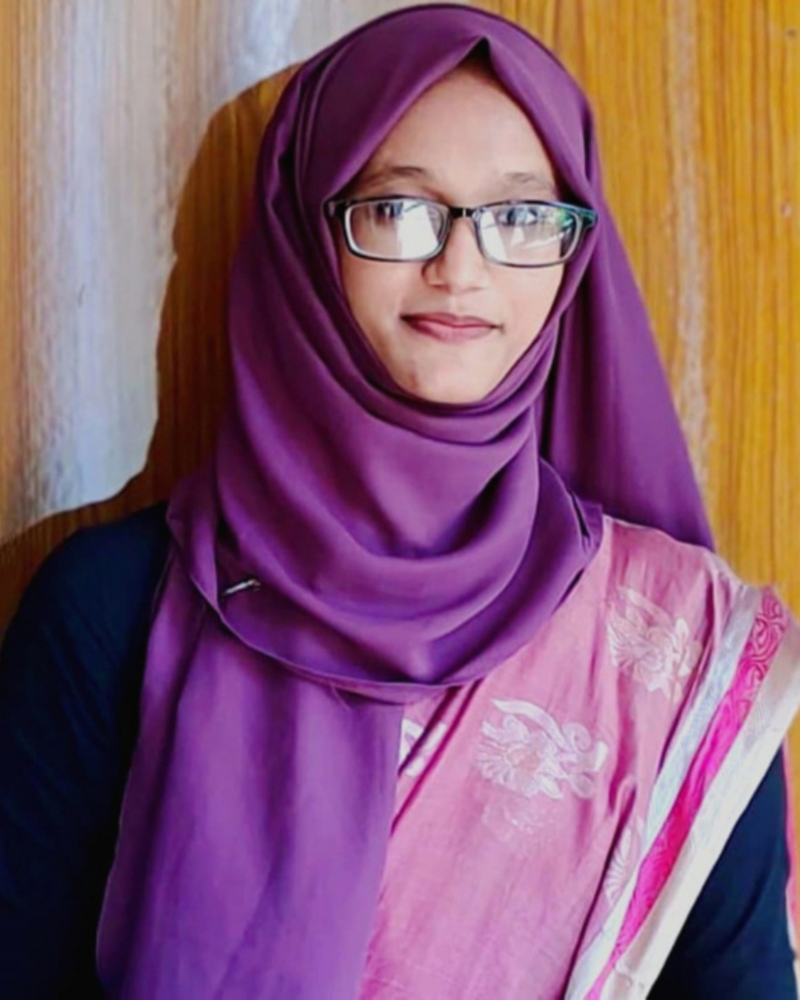

<!--markdown learnings-->

Tawfica Bhuiyan  
Hello World

---

# Tawfica Bhuiyan

## Tawfica Bhuiyan

### Tawfica Bhuiyan

<p>Hello I am Tawfica Bhuiyan.I am an student of Jahangirnagar University doing my Bsc in IIT.</p>

### Italic

<i>This is an Itaic</i>  
_This is an Itaic_

### Bold

**This is an Itaic**

### StrikeThrough

~~This is an StrikeThrough~~

### Single Line Code

`This is inline`  
`<h1> Bangladesh </h1>`

### Multiple Line Code

```html
<html>
  <head> </head>
  <body></body>
</html>
```

```c++
#include bits/stdc++.h
int main() {
    cout << "Hello World" << "\n";
    return 0;
}
```

### Ordered List

1. Item1
2. Item2
   1. Item2.1
   2. Item2.2
3. Item3

### Unordered List

- Item1
  - Item1.1
  - Item1.2
- Item2
- Item3

### Task List

- [x] Task1
- [x] Task2
- [] Task3

### Automatic Link

https://github.com/TawficaBhuiyan

### Disable Link

`https://github.com/TawficaBhuiyan`

### Markdown Link Syntax

[TawficaLearns](https://github.com/TawficaBhuiyan)

### Markdown Link Syntax Shortcut

[TawficaLearns][websitelink]

### image Syntax

<!--  -->
  
😊

### table add

| Name            | Email                    |
| --------------- | ------------------------ |
| Tawfica Bhuiyan | bhuiyantawfica@gmail.com |
| Tawhida Bhuiyan | N/A                      |

<!-- all link is here -->

[websitelink]: https://github.com/TawficaBhuiyan
